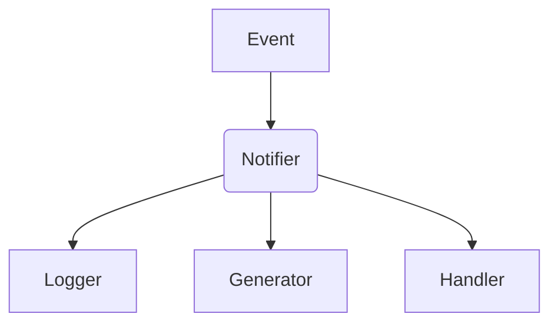

# System Prototype for Biathlon Competitions

[](https://golang.org/)
[](https://opensource.org/licenses/Apache-2.0/)

Прототип системы для моделирования соревнований по биатлону с использованием паттерна Наблюдатель.

С детальными требованиями можно ознакомиться в task.md.

## Предварительные требования
- Go версии 1.23 или выше
- Файл конфигураций в формате JSON
- Файл c набором событий

Пример конфигураций и набора событий находится в
```
examples/sunny_5_skiers
    ├── config.json
    └── events
```

## Установка
```bash
# Клонировать репозиторий
git clone https://github.com/Urtix/biathlonCompetitions.git
cd biathlonCompetitions
```

## Запуск проекта
```bash
go run main.go config.json events
```
или
```bash
go build -o biathlon main.go
./biathlon config.json events
```

## Запуск тестов
```bash
go test -v ./...
```

## Архитектура
```
/internal
    ├── config/        # Загрузка и валидация конфигураций
    ├── events/        # Модели событий
    ├── generator/     # Генерация исходящих событий
    ├── handler/       # Обработка событий
    ├── logger/        # Логирование событий в консоль
    ├── observer/      # Реализация паттерна Наблюдатель
    └── utils/         # Вспомогательный пакет
```
Паттерн Наблюдатель обеспечивает независимость ключевых компонентов:

Благодаря этому расширение существущих компонентов или добавление новых не повлияет на другую функциональность.

## Контакты
tg: @Ze17dan
